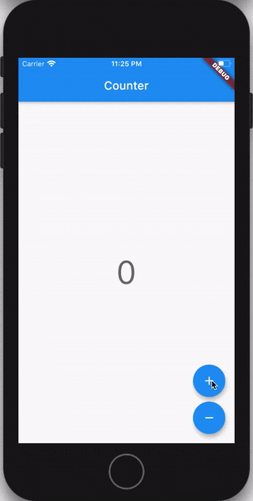

# flutter_counter

This shows how to build a Counter in Flutter using the Bloc library.

Key Topics
    Observe state changes with BlocObserver.
    BlocProvider, Flutter widget which provides a bloc to its children.
    BlocBuilder, Flutter widget that handles building the widget in response to new states.
    Using Cubit instead of Bloc. What's the difference?
    Adding events with context.read.⚡
